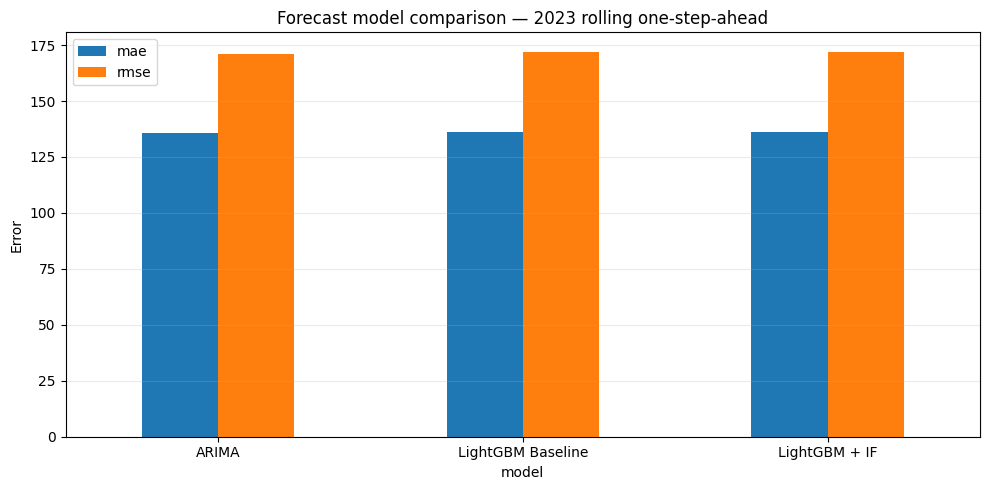

# Beverage Sales Analytics and Hybrid ML Pipeline

## Project Overview

This project explores a **Beverage Sales** dataset and builds a structured analytics and machine learning workflow focused on:

- sales intelligence
- data quality validation
- time-based feature engineering
- anomaly detection
- baseline modeling
- hybrid modeling
- performance benchmarking

---

## Business Motivation

Sales data often contains:

- seasonality
- regional demand differences
- product-level variation
- unusual peaks and drops
- behavior changes over time

Because of that, this project investigates both:

1. **normal sales patterns**
2. **unusual sales behavior through anomaly detection**

The main idea is to test whether anomaly-related signals can improve supervised model performance when compared to a simpler baseline approach.

---

## Main Objectives

This project was created to answer questions such as:

- How do beverage sales behave over time?
- Can we detect unusual demand spikes and drops?
- Which time-based features help describe sales dynamics?
- Does anomaly information add value to a supervised model?
- How does a hybrid model compare against a baseline model?

---

## Notebook Execution Order

The project was organized as a notebook pipeline. The recommended execution order is:

1. 01_data_loading.ipynb
2. 02_data_quality.ipynb
3. 03_feature_engineering.ipynb
4. 04_anomaly_detection.ipynb
5. 05_Baseline_Model.ipynb
6. 06_Hybrid_Model.ipynb
7. 07_Interpretability_SHAP_Analysis.ipynb
8. 08_performance_benchmarking.ipynb
9. 09_ARIMA_LightGBM_comparison.ipynb
(*) Project status: Documentation and experimental results are available. Source code and reproducibility notebooks are being prepared for publication.

---

## Notebook Summary

### 1. `data_loading.ipynb`

#### Purpose
Loads the raw dataset, standardizes columns, converts data types, and prepares the base data for the next stages.

#### Main tasks
- load raw CSV data
- inspect schema and columns
- standardize structure
- convert date fields
- save processed data

#### Output
- cleaned dataset
- processed file ready for downstream analysis

---

### 2. `data_quality.ipynb`

#### Purpose
Validates whether the processed dataset is reliable enough for analysis and modeling.

#### Main tasks
- missing value checks
- invalid or inconsistent record detection
- business-rule validation
- quality summary generation

#### Output
- quality report
- validated dataset for feature engineering

---

### 3. `feature_engineering.ipynb`

#### Purpose
Transforms raw sales data into time-based and business-oriented features for analysis and machine learning.

#### Main tasks
- aggregate sales information
- create rolling window statistics
- generate lag-based features
- build ratio-based features
- prepare model-ready inputs

#### Example features
- `quantity_sum`
- `total_price_sum`
- `unit_price_mean`
- `discount_mean`
- `order_count`
- `customer_count`
- `avg_ticket`
- rolling means
- rolling standard deviations
- historical comparison metrics

#### Output
- feature-enriched dataset

---

### 4. `anomaly_detection.ipynb`

#### Purpose
Detects unusual sales behavior using anomaly detection logic.

#### Main tasks
- load engineered features
- train or load anomaly detection model
- generate anomaly scores
- generate anomaly flags
- save anomaly-enriched outputs

#### Output
- anomaly scores
- anomaly flags
- enriched dataset for downstream modeling

---

### 5. `BaseLine.ipynb`

#### Purpose
Builds the baseline supervised model used as the main reference point in the project.

#### Main tasks
- load modeling features
- prepare train / validation / test logic
- train the baseline model
- evaluate predictive performance
- generate benchmark metrics

#### Output
- trained baseline model
- baseline metrics
- reference results for comparison

---

### 6. `HybridModel.ipynb`

#### Purpose
Builds the hybrid solution by combining anomaly-related information with supervised learning.

#### Main tasks
- load engineered features
- include anomaly outputs as additional signals
- train the hybrid model
- evaluate predictive performance
- compare hybrid results against the baseline

#### Output
- trained hybrid model
- hybrid model metrics
- comparison-ready outputs

---

### 7. `performance_benchmarking.ipynb`

#### Purpose
Consolidates results and compares the final performance of the modeling approaches.

#### Main tasks
- gather baseline results
- gather hybrid model results
- compare metrics
- visualize model differences
- summarize performance trade-offs

#### Output
- benchmark tables
- comparison plots
- final performance summary

---

## Workflow Logic

The project follows this logic:

**raw data -> data quality -> feature engineering -> anomaly detection -> baseline model -> hybrid model -> performance benchmarking**

---

## Visual Analysis

This project also includes visual analysis to improve interpretability and business understanding.

### Boxplot

Used to summarize the distribution of `Quantity` with focus on:

- median
- quartiles
- spread
- possible outliers

### Violin Plot

Used when a richer view of the distribution is needed.

Why it is useful:

- shows density shape
- highlights concentration zones
- makes long-tail behavior easier to interpret

### Why `Quantity` was used instead of `quantity_sum` in distribution plots

For distribution analysis, the raw `Quantity` field is more appropriate because it preserves the natural variability of the observations.

Using `quantity_sum` in boxplots or violin plots could distort interpretation because it is already an aggregated metric.

### Outlier Plot by Period

This chart was used to detect unusual **daily total demand** over time.

For this use case, aggregation makes sense because the goal is to identify abnormal daily behavior rather than the distribution of individual records.

---

## Technical Design Choices

### Parameterized filters

Visualization functions were designed with reusable filters such as:

- `Category`
- `Region`

Example:

```python
filters = {
    "Category": ["Soft Drinks", "Water", "Juices"],
    "Region": ["Baden-Württemberg"]
}
```

This improves:

- code reuse
- flexibility across business slices
- maintainability
- future reuse in dashboards or APIs

### Hybrid modeling idea

A central idea of the project is that anomaly-related information can complement supervised learning.

This reflects a practical machine learning engineering mindset:

- use unsupervised signals to enrich structured data
- compare against a simpler baseline
- validate whether extra complexity adds real value

---

## Project Strengths

This project demonstrates:

- structured notebook pipeline
- data preparation discipline
- data quality validation
- time-based feature engineering
- anomaly detection for business data
- baseline vs hybrid model comparison
- reusable Python components
- visual analysis for business interpretation
- portfolio-ready technical documentation

---

## Skills Demonstrated

### Core technical skills
- Python
- Pandas
- NumPy
- Matplotlib
- Scikit-learn
- Feature Engineering
- Exploratory Data Analysis (EDA)
- Data Visualization
- Anomaly Detection
- Supervised Machine Learning
- Model Benchmarking
- Time-Series Feature Engineering
- Business Data Analysis

### ML and analytics skills
- baseline model design
- hybrid modeling strategy
- outlier analysis
- distribution analysis
- rolling window features
- lag-based reasoning
- anomaly-aware modeling
- evaluation and comparison of models

### Engineering and project skills
- notebook pipeline structuring
- reusable code design
- parameterized visual components
- technical documentation
- GitHub-ready project organization
- analytical storytelling

---

## ARIMA X LightGBMRegressor X LightGBMRegressor + Isolation Forest 

## Model Comparison



The models were compared at the same aggregation level, using the same target variable and over the same test period in 2023. The evaluation used **rolling one-step-ahead** forecasting, where each prediction incorporates the observed history up to the immediately preceding moment.

| Model | Approx. MAE | Approx. RMSE | Result Interpretation |
|---|---:|---:|---|
| ARIMA | 135 | 171 | Slight numerical advantage |
| LightGBM baseline | 136 | 172 | Practically equivalent performance |
| LightGBM + Isolation Forest | 136 | 172 | Marginal gain compared to baseline |

> The values in the table are rounded according to the comparison chart. In the technical report, the full values exported by the evaluation pipeline should be used.

## Main Conclusion

The experiment did not show a clear superiority of LightGBM over ARIMA. The results represent a **technical tie**, with a minor numerical advantage for the statistical model.

This behavior aligns with the dataset's characteristics. Since there are few external variables to explain demand changes, the models rely mainly on their own sales history. In this scenario, a relatively simple autoregressive model can be just as competitive as a more flexible Machine Learning approach.

The result highlights an important lesson: **increasing model complexity does not guarantee better forecasts when the data does not provide enough explanatory signal**.

## How Seasonality Was Represented

LightGBM does not have a native seasonal component like a statistical seasonal model. Part of the time patterns was represented through feature engineering, including:

- Lagged values, always created with `shift(1)` to avoid data leakage;
- 7-day and 30-day rolling means, standard deviations, and sums;
- Calendar variables, such as week, month, and weekend flags;
- Relationships between current observations and recent historical behavior;
- Average price and discount information across time windows.

These features allow the model to capture weekly and monthly patterns indirectly. However, the project does not claim to explicitly model a robust annual seasonality. Doing so would require more historical cycles, features like `lag_365` or Fourier terms, and an additional comparison with SARIMA under the exact same time protocol.

## Why LightGBM Remains Relevant

Even without outperforming ARIMA in this setup, LightGBM provides a strong foundation for future project developments:

- Inclusion of price, discounts, marketing campaigns, holidays, weather, events, and stockouts;
- Learning non-linear interactions and relationships;
- Forecast explainability using SHAP;
- Segmented analysis by product, customer, or period;
- Integration with the anomaly detection phase;
- Model deployment via API and consumption by analytics applications.

Therefore, choosing LightGBM should not be justified only by current global metrics, but by its capacity to evolve into a multivariate and explainable forecasting model as new data sources are added.

## Role of Isolation Forest

Isolation Forest was used to identify atypical observations and provide additional signals to the forecasting model. In the overall evaluation, its inclusion led to only a marginal change compared to the LightGBM baseline.

This does not necessarily mean the step is useless. Its utility should also be evaluated on subsets classified as anomalous, checking if error reduction occurs specifically during periods of high instability. This segmented analysis provides more insight than expecting a large change in the global average.

## Known Limitations

- Few external variables related to real demand drivers;
- Lack of data on campaigns, local holidays, weather, competition, inventory, and stockouts;
- Limited history to estimate annual seasonality reliably;
- `One-step-ahead` evaluation, which does not fully represent long-term horizons without updates;
- Small differences between models, which need confirmation through error analysis by period and, ideally, statistical testing.


