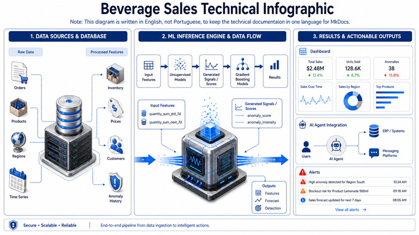
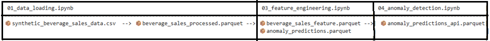
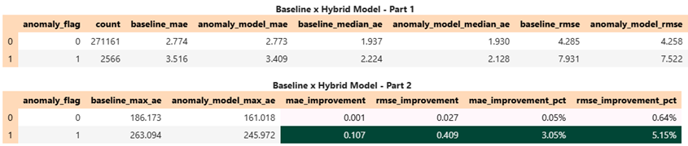
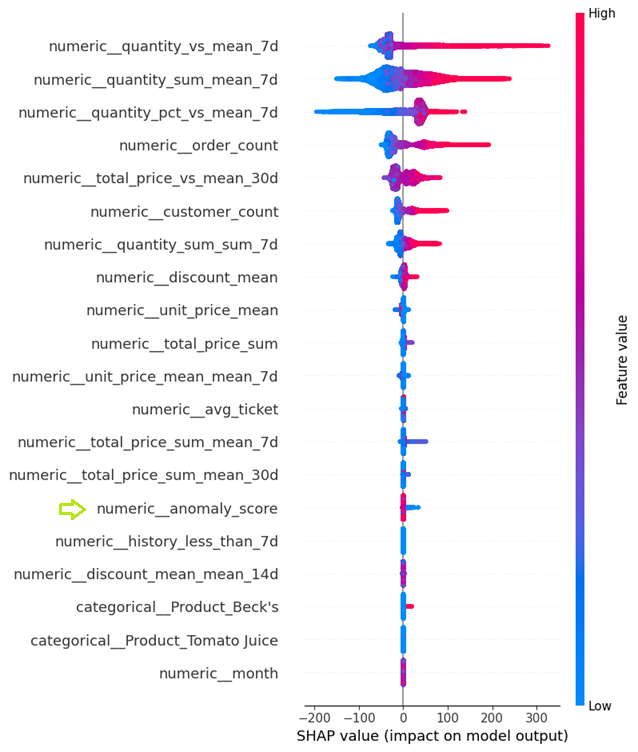
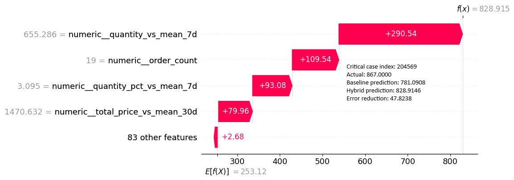

# Análise de Vendas de Bebidas e Pipeline Híbrido de ML
 
📝Idioma: <small>A documentação é mantida quase inteiramente em inglês para garantir consistência técnica e evitar retrabalho.</small>
             <small>The documentation is maintained in English to guarantee technical consistency and avoid redundant documentation work.</small>

## Dataset
 <small>https://www.kaggle.com/datasets/sebastianwillmann/beverage-sales</small>

## Visão Geral

Este projeto propõe um **pipeline híbrido de previsão para vendas de bebidas** que combina:

- **previsão supervisionada de demanda** com **LightGBM**
- **detecção não supervisionada de anomalias** com **Isolation Forest**
- **análise de explicabilidade** com **SHAP**
- **engenharia de atributos temporais** usando **sliding windows**, estatísticas móveis e razões orientadas ao negócio

A ideia central é simples: um modelo de previsão pode se beneficiar de sinais que indiquem quando o contexto de vendas parece incomum.  
Em vez de usar apenas atributos tradicionais de defasagem e janelas móveis, o projeto adiciona uma camada de anomalia para que o modelo de previsão consiga reagir melhor a comportamentos de demanda raros, instáveis ou inesperados.

---

## Motivação de Negócio

Os dados de vendas raramente se comportam de forma perfeitamente estável. Em cenários reais, a demanda pode aumentar ou cair devido a:

- mudanças locais de demanda
- promoções ou descontos
- comportamento específico por produto/região
- mudanças na concentração de clientes
- eventos incomuns de negócio

Um modelo treinado apenas em médias históricas pode funcionar bem em períodos normais, mas ter dificuldades quando o padrão se torna menos estável.  
Por isso, este projeto investiga se uma **previsão sensível a anomalias** pode melhorar o desempenho em comparação com um **modelo base de previsão**.

---

## Objetivo Principal

Construir e avaliar um fluxo de previsão capaz de prever vendas agregadas de bebidas, respondendo à seguinte pergunta:

> Um modelo híbrido que recebe sinais de anomalia do Isolation Forest tem desempenho melhor do que um modelo base padrão?

---

##### ⚙️The project follows this logic:
**raw data -> data quality -> feature engineering -> anomaly detection -> baseline model -> hybrid model -> performance benchmarking** 

##### ⚙️Execution order
The project was organized as a notebook pipeline. The recommended execution order is: 
📝01_data_loading.ipynb -> 📝02_data_quality.ipynb -> 📝03_feature_engineering.ipynb -> 📝04_anomaly_detection.ipynb ->  
📝05_BaseLine.ipynb -> 📝06_HybridModel.ipynb -> 📝07_Interpretability_SHAP_Analysis.ipynb -> 📝08_performance_benchmarking.ipynb  

Suggested execution order:

1. `01_data_loading.ipynb`
2. `02_data_quality.ipynb`
3. `03_feature_engineering.ipynb`
4. `04_anomaly_detection.ipynb`
5. `05_BaseLine.ipynb`
6. `06_HybridModel.ipynb`
7. `07_Interpretability_SHAP_Analysis.ipynb`
8. `08_performance_benchmarking.ipynb`

---

### Export parquet to API project

Para finalizar o pipeline, um arquivo Parquet compactado é gerado para abastecer a API. Ele é necessário exclusivamente no projeto Beverage-Sales, já que a API utiliza dados históricos para responder às requisições devido à implementação da Janela Deslizante (Sliding Window)
Localizacao (data/exports)
- 📦`anomaly_predictions_api.parquet`

---

## Storytelling do Projeto

O projeto foi desenhado como um pipeline estruturado, e não como um experimento isolado em notebook.

O fluxo começa com dados brutos transacionais de vendas em formato CSV.  
A partir daí, os dados são validados, transformados, enriquecidos com atributos temporais e agregados, e finalmente usados em duas estratégias de modelagem:

1. **Modelo base**  
   Um regressor LightGBM treinado apenas com atributos de negócio e de séries temporais.

2. **Modelo híbrido**  
   Um regressor LightGBM treinado com os mesmos atributos **mais** sinais de anomalia gerados pelo Isolation Forest.

Após o treinamento de ambos os modelos, o projeto compara seu comportamento globalmente e, mais importante, em períodos marcados como anômalos.  
Essa é uma distinção relevante porque espera-se que a modelagem sensível a anomalias ajude mais **quando os dados se desviam do comportamento normal**, e não necessariamente em todos os cenários estáveis.

Por fim, o projeto usa **SHAP** para tornar o modelo híbrido mais interpretável e verificar se os atributos de anomalia realmente contribuem para as decisões do modelo.

---

## Fluxo End-to-End

O projeto segue esta ordem de execução:

1. `01_data_loading.ipynb`
2. `02_data_quality.ipynb`
3. `03_feature_engineering.ipynb`
4. `04_anomaly_detection.ipynb`
5. `05_BaseLine.ipynb`
6. `06_HybridModel.ipynb`
7. `07_Interpretability_SHAP_Analysis.ipynb`
8. `08_performance_benchmarking.ipynb`

### Função de cada Notebook

| Notebook | Papel no pipeline |
|---|---|
| `01_data_loading.ipynb` | Carrega os dados brutos em CSV e os salva em formato Parquet |
| `02_data_quality.ipynb` | Aplica regras de validação e verifica se os dados processados são confiáveis |
| `03_feature_engineering.ipynb` | Constrói atributos temporais, móveis, de razão e agregados |
| `04_anomaly_detection.ipynb` | Treina o Isolation Forest e gera `anomaly_score` e `anomaly_flag` |
| `05_BaseLine.ipynb` | Treina o modelo base com LightGBM |
| `06_HybridModel.ipynb` | Treina o modelo híbrido com LightGBM e sinais de anomalia |
| `07_Interpretability_SHAP_Analysis.ipynb` | Explica o modelo híbrido usando SHAP |
| `08_performance_benchmarking.ipynb` | Compara o desempenho do modelo base versus o híbrido |

---

## Carga de Dados e Persistência

O primeiro notebook converte o dataset bruto em CSV para **Parquet**, o que é uma decisão prática de engenharia porque melhora:

- desempenho de leitura
- consistência do pipeline
- reprodutibilidade entre etapas
- reutilização mais fácil em notebooks e APIs posteriores

Esse passo pode parecer simples, mas é importante porque transforma o projeto em um fluxo mais orientado à produção, em vez de uma exploração pontual em notebook.

---

## Validação de Qualidade dos Dados

Antes de construir atributos ou modelos, o projeto valida o dataset processado.

### Regras de qualidade verificadas

O notebook de qualidade avaliou 10 regras de validação, incluindo:

- quantidade ausente
- quantidade negativa
- desconto ausente
- desconto negativo
- desconto acima de um
- tipo de cliente inválido
- violação da regra de desconto B2C
- data do pedido inválida
- linhas duplicadas exatas
- consistência do preço total

### Resultado

O relatório de qualidade indicou:

- **Regras avaliadas:** 10  
- **Regras com problemas encontrados:** 0  
- **Total de problemas:** 0  
- **Problemas de alta severidade:** nenhum detectado

### Interpretação

Essa é uma base importante para o restante do projeto.  
Um modelo de previsão só pode ser confiável se os dados de entrada também forem confiáveis.  
Ao validar explicitamente as regras de negócio antes da geração de atributos, o projeto reduz o risco de aprender com registros inválidos ou inconsistências silenciosas na origem dos dados.

---

## Engenharia de Atributos

Esta etapa é uma das partes mais fortes do projeto.

Em vez de tratar o problema como uma tarefa genérica de regressão tabular, o notebook introduz atributos sensíveis ao tempo e ao negócio que ajudam o modelo a entender o comportamento da demanda de forma mais realista.

### Principais atributos gerados

O projeto inclui atributos como:

- `quantity_sum`
- `total_price_sum`
- `unit_price_mean`
- `discount_mean`
- `order_count`
- `customer_count`
- `avg_ticket`
- `day_of_week`
- `month`
- `year`
- `is_weekend`

Também cria atributos móveis e contextuais como:

- `quantity_sum_mean_7d`
- `quantity_sum_std_7d`
- `quantity_sum_sum_7d`
- `total_price_sum_mean_7d`
- `total_price_sum_std_7d`
- `total_price_sum_mean_30d`
- `unit_price_mean_mean_7d`
- `discount_mean_mean_14d`
- `quantity_vs_mean_7d`
- `total_price_vs_mean_30d`
- `quantity_pct_vs_mean_7d`
- `history_less_than_7d`
- `history_less_than_30d`

### Por que isso importa

Esses atributos fazem mais do que resumir o histórico.  
Eles dão ao modelo uma noção de:

- comportamento de curto prazo
- dispersão e estabilidade
- aceleração ou desaceleração recente da demanda
- relação entre a demanda atual e a média local recente
- maturidade da janela histórica

Esse é exatamente o tipo de engenharia de atributos que permite que modelos baseados em árvores, como o LightGBM, funcionem bem em contextos de séries temporais.

---

## Lógica de Sliding Window

Uma ideia técnica central neste projeto é o uso de **sliding windows**.

Em vez de alimentar o modelo apenas com o registro atual, o projeto resume o histórico recente em janelas como 7, 14 e 30 dias.  
Isso torna possível converter um problema temporal em um problema supervisionado baseado em atributos, sem ignorar a ordem dos eventos.

### Interpretação prática

A sliding window permite que o modelo responda a perguntas como:

- Qual foi a demanda média nos últimos 7 dias?
- Quão instável a demanda esteve recentemente?
- O valor atual está acima ou abaixo do nível normal recente?
- Há histórico suficiente para confiar nessas estatísticas?

### Por que sliding window é importante aqui

Sem essa etapa, o LightGBM receberia majoritariamente colunas estáticas e não entenderia bem o contexto temporal.  
Com as sliding windows, o modelo ganha uma visão compacta da dinâmica de curto prazo e consegue capturar melhor o comportamento local da demanda.

### Força técnica

Essa é uma das razões pelas quais o projeto é mais forte do que um simples exercício de “aplicar LightGBM em um dataset”.  
O modelo não está dependendo apenas do algoritmo.  
Ele está dependendo de uma representação do tempo bem planejada.

---

## Análise Exploratória e Inspeção de Outliers

O notebook de engenharia de atributos também inclui análise visual exploratória, como:

- análise de distribuição
- boxplots
- violin plots
- inspeção de outliers baseada em IQR

Essas análises são úteis por dois motivos:

1. Elas mostram que o autor investigou os dados antes da modelagem.
2. Elas ajudam a justificar por que a detecção de anomalias faz sentido neste dataset.

A exploração visual sugere que a quantidade vendida não é perfeitamente estável e que os dados contêm comportamento assimétrico e observações incomumente altas.  
Isso fornece uma motivação natural para testar uma arquitetura sensível a anomalias.

###### <small>1. Nota</small>
A distribuição mostrada nos seus dados de vendas de bebidas — caracterizada por uma base densa e um “pescoço” fino de outliers — é um desafio significativo para modelos aditivos como o Prophet.

* **Distorção da sazonalidade**: o Prophet identifica padrões repetitivos com base no tempo. Se um pico de vendas de **100 unidades** acontecer em dezembro, o modelo pode rotular isso incorretamente como um “efeito dezembro” permanente. Isso leva a superprevisão em anos futuros, mesmo que o pico tenha sido uma anomalia pontual.
* **Instabilidade de tendência**: como o Prophet é um modelo baseado em regressão, ele é altamente sensível a valores extremos. Um único outlier nesse “pescoço” pode puxar toda a tendência de base para cima, fazendo o modelo perder precisão nos dias normais de venda.
* **Inflação da incerteza**: o modelo calcula intervalos de incerteza com base na variância histórica. Quando ele vê valores variando de **0 a 100** enquanto a mediana é apenas **10–15**, os intervalos de previsão ficam tão amplos que perdem valor prático para planejamento de estoque.

---

###### <small>2. Análise Comparativa: Prophet vs. Modelo Híbrido</small>
A abordagem híbrida usando **Isolation Forest** e **LightGBM** supera essas limitações ao focar em transparência técnica e **Explainable AI (XAI)**.

| Característica | Prophet (Padrão) | Seu Modelo Híbrido (Orientado por XAI) |
| :--- | :--- | :--- |
| **Tratamento de outliers** | Tenta ajustar a curva aos outliers, distorcendo a tendência de longo prazo. | Usa um `anomaly_flag` para isolar e identificar eventos incomuns. |
| **Lógica de previsão** | Depende estritamente de padrões baseados em tempo, como dias ou meses. | Usa direcionadores operacionais, como `order_count` e `quantity_vs_mean_7d`. |
| **Interpretabilidade** | Difícil explicar por que um pico ou queda específica ocorreu. | Usa **gráficos waterfall do SHAP** para mostrar exatamente quais atributos conduziram a previsão. |
| **Acurácia** | Frequentemente superestima a demanda após observar um pico histórico. | Reduz o erro (MAE/RMSE) ao reconhecer e ajustar atividade incomum. |

---

## Detecção de Anomalias com Isolation Forest

A etapa de detecção de anomalias treina um modelo **Isolation Forest** para detectar comportamento incomum nas vendas.

### Decisão metodológica importante

O notebook afirma explicitamente que, para evitar leakage, o modelo de anomalia é treinado apenas em:

- **2021**
- **2022**

O ano de **2023** é deixado para teste.

Essa é uma escolha de design muito boa porque preserva o realismo temporal.

### Melhores parâmetros encontrados

O notebook reporta os seguintes melhores parâmetros para o Isolation Forest:

- `contamination = 0.01`
- `max_features = 1.0`
- `max_samples = 512`
- `n_estimators = 100`

### Sinais de anomalia gerados

A etapa de detecção de anomalias produz pelo menos dois atributos importantes:

- `anomaly_score`
- `anomaly_flag`

Esses sinais são depois injetados no modelo híbrido com LightGBM.

### Por que isso é útil

O Isolation Forest não está sendo usado aqui como modelo preditivo final.  
Ele está sendo usado como um **detector de contexto**.

Essa é a principal ideia arquitetural:

- o modelo não supervisionado identifica contextos incomuns
- o modelo supervisionado usa essa informação para melhorar a previsão de demanda

Essa é uma forte decisão de design porque combina duas perspectivas de modelagem diferentes de forma complementar.

---

## Modelo Base de Previsão

O notebook base treina um **regressor LightGBM** usando apenas os atributos temporais e de negócio gerados.

### Atributos usados no modelo base

O modelo base usa:

- agregações de negócio
- atributos de calendário
- estatísticas de janelas móveis
- atributos de razão/contexto
- identificadores categóricos como `Product` e `Region`

### Métricas reportadas do modelo base

O notebook reporta as seguintes métricas de avaliação:

- **MAE:** `2.7275`
- **RMSE:** `4.1588`
- **R²:** `0.999305`

### Interpretação

Esses valores indicam que o modelo base já é muito forte.

- Um **MAE baixo** sugere que o erro médio de previsão é pequeno.
- Um **RMSE baixo** indica que erros grandes estão relativamente controlados.
- Um **R² muito alto** sugere que o modelo explica quase toda a variância observada no alvo.

Ainda assim, em problemas de previsão, ter um baseline forte não é motivo para parar.  
Ele é o ponto correto de comparação para estratégias mais avançadas.

---

## Modelo Híbrido de Previsão

O notebook híbrido treina outro **regressor LightGBM**, mas agora com duas entradas adicionais:

- `anomaly_score`
- `anomaly_flag`

Isso significa que o modelo recebe tanto:

- o contexto normal estruturado de vendas
- quanto um sinal indicando se o contexto atual parece incomum

### Métricas reportadas no notebook híbrido

O notebook reporta:

- **MAE:** `2.7463`
- **RMSE:** `4.1904`
- **R²:** `0.999295`

### Observação importante sobre a interpretação

Essas métricas do notebook híbrido devem ser lidas com cautela quando comparadas diretamente com a seção final de benchmark, porque o projeto depois realiza uma comparação mais detalhada, separada por condição de anomalia e contexto de treino/teste.

A conclusão mais importante do projeto **não** vem da leitura isolada das métricas do notebook híbrido.  
Ela vem da etapa dedicada de benchmark, onde os dois modelos são comparados de forma mais estruturada.

---

## Benchmark de Desempenho

Este é o notebook que entrega a resposta final mais significativa.

Em vez de comparar apenas uma métrica global, o projeto avalia ambos os modelos por **grupo de anomalia**.

Isso é importante porque espera-se que a abordagem híbrida ajude especialmente quando o comportamento de vendas é incomum.

---

## Comparação do Lado de Treino por Grupo de Anomalia

A saída do benchmarking para a comparação no conjunto de treino mostra:

| anomaly_flag | count | baseline_mae | hybrid_mae | baseline_rmse | hybrid_rmse | mae_improvement_pct | rmse_improvement_pct |
|---|---:|---:|---:|---:|---:|---:|---:|
| 0 | 543470 | 2.6905 | 2.6947 | 3.9699 | 3.9670 | -0.1557% | 0.0736% |
| 1 | 5490 | 6.3946 | 6.2201 | 13.0114 | 12.3144 | 2.7286% | 5.3573% |

### Interpretação

Esse resultado é muito revelador:

- Em **casos normais** (`anomaly_flag = 0`), o modelo híbrido se comporta quase da mesma forma que o baseline.
- Em **casos anômalos** (`anomaly_flag = 1`), o modelo híbrido mostra uma melhoria clara.

Isso é exatamente o que se esperaria observar.

Os atributos de anomalia não distorcem radicalmente o modelo em períodos normais.  
Em vez disso, parecem se tornar mais úteis quando o contexto é instável.

---

## Comparação do Lado de Teste por Grupo de Anomalia

A comparação no conjunto de teste mostra:

### Interpretação

Análise dos resultados por anomaly_flag

Esta tabela compara o modelo base e o modelo híbrido em dois grupos diferentes:

anomaly_flag = 0: períodos normais
anomaly_flag = 1: períodos anômalos

A ideia principal é verificar se o modelo híbrido apresenta melhor desempenho, especialmente quando os dados mostram comportamento incomum.

#### 1. Períodos normais (anomaly_flag = 0)

Este grupo contém 271.161 observações, então representa quase todo o dataset.
Nesse cenário, o modelo híbrido mostra uma pequena melhoria em relação ao baseline.

MAE cai de 2.774 para 2.773
Median AE cai de 1.937 para 1.930
RMSE cai de 4.285 para 4.258
Max AE cai de 186.173 para 161.018

A melhoria percentual é pequena:

Melhoria de MAE: cerca de 0,05%
Melhoria de RMSE: cerca de 0,64%

Isso significa que, em períodos normais, ambos os modelos se comportam de forma muito semelhante.
O modelo híbrido é ligeiramente melhor, mas o ganho é modesto. Isso é esperado, porque em períodos estáveis o modelo base já apresenta bom desempenho.

#### 2. Períodos anômalos (anomaly_flag = 1)

Este grupo contém apenas 2.566 observações, então é muito menor, mas também mais importante do ponto de vista de negócio, porque são os casos difíceis.

Aqui, o modelo híbrido apresenta desempenho de forma mais claramente melhor do que o baseline:

MAE cai de 3.516 para 3.409
Median AE cai de 2.224 para 2.128
RMSE cai de 7.931 para 7.522
Max AE cai de 263.094 para 245.972

As melhorias são muito mais relevantes:

Melhoria de MAE: cerca de 3,05%
Melhoria de RMSE: cerca de 5,15%

Este é um resultado importante. Ele sugere que a abordagem híbrida ajuda mais quando o padrão é incomum ou mais difícil de prever. Em outras palavras, a informação relacionada à anomalia parece adicionar sinal útil exatamente onde o problema de previsão é mais complexo.

#### 3. Comparação entre períodos normais e anômalos

A tabela também mostra que períodos anômalos são naturalmente mais difíceis para ambos os modelos.

Por exemplo:

Em períodos normais, o RMSE do baseline é 4.285
Em períodos anômalos, o RMSE do baseline sobe para 7.931

O mesmo acontece com MAE e Max AE.
Isso indica que períodos anômalos contêm mais incerteza, mais volatilidade ou padrões mais difíceis de aprender.

Por isso, o fato de o modelo híbrido melhorar de forma mais forte no grupo anômalo é significativo. Não é apenas uma melhoria estatística, mas também um sinal de que o componente de detecção de anomalias pode estar ajudando o modelo de previsão a focar em situações difíceis.

#### 4. Interpretação final

No geral, os resultados sugerem o seguinte:

O modelo híbrido não prejudica o desempenho em períodos normais
Ele traz ganhos pequenos, mas positivos, em situações estáveis
Ele traz ganhos mais relevantes em períodos anômalos
Ele também reduz o erro máximo, o que é útil porque erros muito grandes podem ser custosos em cenários reais

#### Interpretação

Globalmente, os ganhos são modestos, o que é esperado porque a maioria dos registros não é anômala.

No entanto, o projeto se torna muito mais convincente quando observamos **onde** os ganhos acontecem:

- o modelo híbrido não está melhorando principalmente os casos fáceis
- ele está melhorando os segmentos mais difíceis e menos estáveis

Esse é um argumento forte a favor do design híbrido.

---

## Por que o Modelo Híbrido Importa

Uma pergunta justa é:

> Se o ganho geral não é tão grande, por que o modelo híbrido é importante?

Porque em muitos problemas reais de negócio, o principal valor não vem de tornar casos já estáveis um pouco melhores.  
Ele vem de reduzir o erro quando o comportamento se torna anormal.

Este projeto mostra exatamente esse padrão:

- períodos estáveis: desempenho quase equivalente
- períodos instáveis: melhor controle de erro com modelagem sensível a anomalias

Isso torna o modelo híbrido estrategicamente valioso.

---

## Análise de Interpretabilidade com SHAP

O projeto usa **SHAP** para entender o modelo híbrido.

Esse é um passo importante porque, uma vez que atributos de anomalia são introduzidos, torna-se necessário explicar se eles realmente influenciam o modelo e como interagem com os outros preditores.

### Atributos mais relevantes reportados

A análise SHAP destaca atributos como:

- `numeric__quantity_vs_mean_7d`
- `numeric__quantity_sum_mean_7d`
- `numeric__quantity_pct_vs_mean_7d`
- `numeric__order_count`
- `numeric__total_price_vs_mean_30d`
- `numeric__customer_count`

### Interpretação

Esse ranking de atributos é coerente com a lógica de negócio do projeto.

O modelo é conduzido principalmente por:

- desvio em relação ao comportamento recente
- nível local recente de demanda
- intensidade de pedidos
- concentração de clientes
- contexto relativo a janelas históricas curtas e médias

Isso é um sinal muito bom, porque mostra que o modelo está aprendendo uma estrutura significativa de demanda, em vez de depender de ruído arbitrário.

### Papel dos sinais de anomalia no SHAP

Por que o Modelo Previu Alta Demanda  
O gráfico waterfall explica como o nosso modelo híbrido ajustou sua previsão para um evento específico de alto impacto. Partindo de uma linha de base de 253.12, o modelo levou em conta vários sinais importantes para chegar a uma previsão final de 828.91.  

Embora o valor real tenha sido 867.00, o modelo híbrido foi muito mais preciso do que o baseline (que previu 781.09), reduzindo o erro de previsão em 47.82 unidades.

Em última análise, este caso prova que a abordagem híbrida se destaca ao capturar comportamentos “incomuns” que modelos padrão podem deixar passar, aproximando muito mais a previsão da realidade durante eventos críticos de vendas.

---

## Interpretação das Principais Métricas

### MAE — Erro Absoluto Médio

O MAE mede a diferença absoluta média entre a previsão e o valor real.

Em termos práticos:

- ele informa quão distante a previsão está da realidade em média
- é fácil de interpretar
- é menos sensível a erros extremos do que o RMSE

Para este projeto, o MAE é útil para entender o erro típico da previsão.

### RMSE — Raiz do Erro Quadrático Médio

O RMSE também mede erro de previsão, mas penaliza erros grandes com mais força.

Em termos práticos:

- ele dá mais peso a erros severos
- é muito útil quando grandes erros são especialmente indesejáveis
- ajuda a detectar se o modelo está tendo dificuldade em casos complexos

Neste projeto, o RMSE é especialmente importante porque o modelo híbrido melhora de forma mais forte em períodos anômalos, onde grandes erros têm maior probabilidade de ocorrer.

### R² — Coeficiente de Determinação

O R² indica quanto da variância do alvo é explicada pelo modelo.

Um R² muito alto é esperado aqui porque o projeto usa um conjunto rico de atributos gerados e um modelo forte baseado em árvores.  
Ainda assim, o R² sozinho não é suficiente para comparar modelos neste contexto.  
MAE e RMSE são mais informativos para entender a qualidade da previsão.

---

## Forças Metodológicas

Este projeto tem vários pontos fortes:

### 1. Estrutura clara de pipeline
O trabalho não é uma exploração solta em notebook.  
Ele segue uma sequência reproduzível do dado bruto até a avaliação.

### 2. Qualidade dos dados antes da modelagem
O projeto valida regras antes da engenharia de atributos e do treinamento.

### 3. Design sensível ao tempo
A divisão treino/teste respeita o tempo:

- treino: 2021–2022
- teste: 2023

### 4. Consciência sobre leakage
O modelo de anomalia também é treinado apenas no período histórico.

### 5. Forte engenharia de atributos
Sliding windows, razões, estatísticas móveis e sinais sensíveis ao contexto estão bem alinhados com a lógica de previsão.

### 6. Arquitetura híbrida
O projeto combina aprendizado não supervisionado e supervisionado de forma significativa.

### 7. Explicabilidade
O uso de SHAP torna o projeto mais robusto e mais fácil de defender tecnicamente.

### 8. Benchmark orientado por segmento
Comparar os modelos por grupo de anomalia é muito mais informativo do que comparar apenas uma métrica global.

---

## Conclusão Final

Este projeto mostra que:

- um modelo base forte de previsão já pode apresentar ótimo desempenho
- adicionar consciência de anomalia não precisa melhorar todos os casos igualmente
- o valor real do modelo híbrido aparece nos períodos mais difíceis, instáveis e incomuns

O benchmark final indica que a combinação **Isolation Forest + LightGBM** é uma abordagem válida e tecnicamente defensável.

A conclusão mais importante não é apenas:

> “O modelo híbrido melhorou?”

Mas sim:

> “Onde ele melhorou, e por que isso importa?”

Neste projeto, a resposta é clara:

- o modelo híbrido é especialmente útil em contextos anômalos
- ele reduz o erro de forma mais significativa onde o problema é mais difícil
- o SHAP confirma que o modelo se apoia em atributos temporais e contextuais coerentes
- a arquitetura geral é consistente com um fluxo real de engenharia de ML

---

## Resumo Executivo Sugerido

Este projeto desenvolveu um pipeline híbrido de previsão de demanda para vendas de bebidas usando LightGBM, Isolation Forest e SHAP.  
Após validar a qualidade dos dados e construir atributos temporais com sliding windows, duas estratégias de previsão foram comparadas: um modelo base e um modelo híbrido sensível a anomalias.

Os resultados mostram que o baseline já é muito forte, mas o modelo híbrido entrega os ganhos mais relevantes em períodos anômalos, onde a previsão é naturalmente mais difícil.  
Isso torna a abordagem híbrida especialmente valiosa do ponto de vista de negócio, já que os maiores e mais instáveis erros costumam ser os mais custosos.

## Notas

Este não é apenas um notebook de previsão.  
É um projeto estruturado de machine learning que conecta:

- disciplina de engenharia de dados
- design de atributos temporais
- modelagem sensível a anomalias
- explicabilidade
- e avaliação orientada por benchmark
