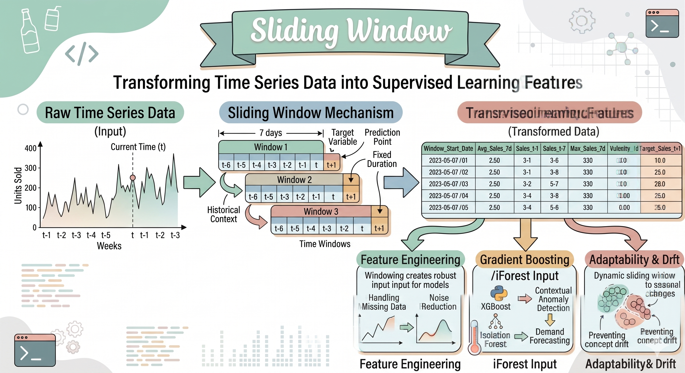
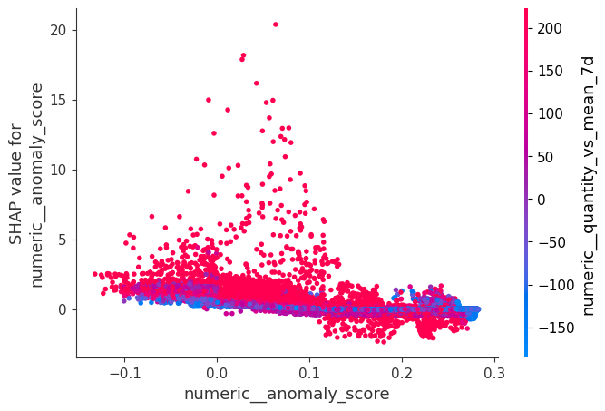

# Projeto de Machine Learning para Beverage Sales  
## Previsão de vendas com apoio de detecção de anomalias

## 1. Visão geral do projeto

Este projeto tem como objetivo analisar vendas históricas de bebidas e construir um modelo capaz de **prever demanda** com apoio de **sinais de comportamento incomum**.

- Dataset : https://www.kaggle.com/datasets/sebastianwillmann/beverage-sales

O dataset possui uma volumetria expressiva de mais de 540.000 registros.  
- Estabilidade Operacional: Nos registros normais, a melhora de 0,32% no RMSE e a queda no Max AE (Erro Máximo) de 158 para 144 são métricas valiosas para a logística. Em uma operação de larga escala (centenas de milhares de unidades), reduzir o erro máximo em 14 unidades em casos críticos evita rupturas de estoque ou excessos desnecessários em produtos de giro rápido.  
- Gestão de Exceções: Foi identificado 5.571 registros anômalos. Embora representem apenas cerca de 1% do total, esses casos são onde o custo operacional de erro é maior (ex: pedidos especiais ou picos imprevistos). 

A ideia central foi combinar:

- um modelo **supervisionado** para previsão de quantidade vendida;
- um modelo **não supervisionado** para identificar padrões anômalos ou raros nos dados.

Na prática, a proposta do projeto foi verificar se adicionar informações de anomalia ao pipeline poderia ajudar o modelo principal a lidar melhor com situações fora do padrão, como oscilações incomuns de vendas, comportamento atípico de preço, desconto ou volume.

#### 1.1 ⚙️The project follows this logic:
**raw data -> data quality -> feature engineering -> anomaly detection -> baseline model -> hybrid model -> performance benchmarking**

#### 1.2 ⚙️Execution order
📝01_data_loading.ipynb -> 📝02_data_quality.ipynb -> 📝03_feature_engineering.ipynb -> 📝04_anomaly_detection.ipynb -> 
📝05_BaseLine.ipynb -> 📝06_HybridModel.ipynb -> 📝07_Interpretability_SHAP_Analysis.ipynb -> 📝08_performance_benchmarking.ipynb 

#### 1.3 Ordem de execução sugerida:

1. `01_data_loading.ipynb`
2. `02_data_quality.ipynb`
3. `03_feature_engineering.ipynb`
4. `04_anomaly_detection.ipynb`
5. `05_BaseLine.ipynb`
6. `06_HybridModel.ipynb`
7. `07_Interpretability_SHAP_Analysis.ipynb`
8. `08_performance_benchmarking.ipynb`

#### 1.4 Bibliotecas utilizadas
- Todas as bibliotecas utilizadas se encontram em:
  🧾requirements.txt

#### 1.5 Divisao do projeto
O projeto se divide em 2 partes
- A parte de Notebook, entendimento do problema, dataset, treinamento e analise dos resultados
- A parte destinada a aplicacao, Flask, REST API e sugestão de aplicacao do modelo

---

## 2. Problema de negócio

Mesmo em um dataset sintético ou semi-sintético, o problema pode ser interpretado como um cenário real de negócio:

- prever vendas futuras por produto e região;
- capturar padrões temporais recentes com janelas deslizantes;
- melhorar a robustez do modelo em períodos menos estáveis;
- apoiar decisões relacionadas a planejamento de estoque, abastecimento e análise de comportamento de demanda.

Em termos práticos, o projeto tenta responder perguntas como:

- **quanto pode ser vendido no próximo período?**
- **o comportamento atual está dentro do padrão histórico ou está diferente do normal?**
- **um modelo que conhece sinais de anomalia consegue errar menos?**

---

## 3. Estratégia adotada

A solução foi pensada em duas partes:

### 3.1 Modelo baseline
Foi criado um modelo supervisionado de regressão como baseline, usando apenas variáveis de negócio e séries temporais derivadas do histórico, sem apoio explícito de anomalias.

Esse modelo representa a referência principal de comparação.

### 3.2 Modelo com apoio de anomalia
Depois, foi adicionada ao pipeline uma camada de detecção de anomalias, gerando variáveis como:

- `anomaly_flag`
- `anomaly_score`

Essas variáveis foram então usadas junto com as demais features no modelo supervisionado final.

O objetivo não foi substituir o modelo de previsão, mas sim **enriquecê-lo com um sinal extra** sobre contextos incomuns. Por este motivo ambos os modelos são "iguais", ou seja ambos são LightGBM, um sem usar detecção de anomalias (Baseline) e o outro com detecção de anomalia (Isolation Forest + LightGBM)

## 3.3 Análise do Sliding Window no projeto Beverage Sales

No projeto **Beverage Sales**, o uso de **Sliding Window** foi uma das partes mais importantes da modelagem.  
A ideia central foi transformar dados históricos de vendas em **sinais temporais úteis para o modelo**, permitindo que ele enxergasse não apenas o valor atual, mas também o **comportamento recente da demanda**.

Em vez de usar somente colunas brutas, o projeto criou variáveis que resumem o histórico mais próximo de cada combinação de negócio, ajudando o modelo a responder perguntas como:

- esta venda está acima ou abaixo do padrão recente?
- houve aceleração ou desaceleração da demanda?
- o preço ou o desconto recente parecem estar influenciando o volume?
- este ponto do tempo parece normal ou incomum para aquele produto e região?

Na prática, o Sliding Window foi usado para criar uma visão de **curto prazo e médio prazo** sobre a série, enriquecendo a base usada pelo **LightGBM Regressor** e, no modelo híbrido, também pelo sinal de anomalia gerado pelo **Isolation Forest**.

---

## 3.3.1 O que é Sliding Window

Sliding Window, ou **janela deslizante**, é uma técnica usada em séries temporais para calcular estatísticas sobre um conjunto móvel de observações passadas.

Em vez de olhar toda a história de uma vez, o algoritmo olha apenas para uma **janela recente** de tempo, por exemplo:

- últimos 7 dias
- últimos 14 dias
- últimos 30 dias

Essa janela “desliza” ao longo do tempo.  
Para cada nova data, o sistema recalcula estatísticas com base apenas no histórico anterior disponível.

Isso é útil porque, em problemas de demanda e vendas, o comportamento mais recente costuma carregar sinais muito importantes, como:

- tendência local
- mudanças de ritmo
- aumento ou queda recente
- estabilidade ou volatilidade
- efeitos de preço e desconto

---

## 3.3.2 Por que Sliding Window foi importante neste projeto

O dataset de Beverage Sales possui uma natureza temporal.  
Mesmo sendo um problema tratado com modelagem tabular, o comportamento das vendas muda ao longo do tempo por fatores como:

- sazonalidade
- promoções
- variações regionais
- diferenças entre produtos
- oscilações recentes de demanda

Se o modelo usasse apenas colunas estáticas ou valores pontuais, ele perderia grande parte desse contexto.

O Sliding Window resolveu isso ao criar features que representam o **histórico recente de cada série local**, tornando a modelagem mais rica sem precisar migrar para uma arquitetura mais complexa, como LSTM ou Transformer.

Em outras palavras, ele permitiu capturar uma parte importante da dinâmica temporal usando um pipeline mais simples, robusto e fácil de explicar.

---

## 3.3.3 Como o Sliding Window funcionou no projeto

No projeto, o Sliding Window foi aplicado sobre métricas agregadas de vendas, respeitando a ordem temporal e a granularidade de negócio.

A lógica geral foi:

1. organizar os dados por tempo;
2. separar as séries por contexto de negócio, como **Product** e **Region**;
3. calcular estatísticas móveis sobre colunas de interesse;
4. usar apenas informações passadas para construir as novas features;
5. alimentar o modelo com essas variáveis derivadas.

Esse processo permitiu que cada linha da base carregasse um pequeno resumo do comportamento recente daquela série.

---

## 3.3.4 Janela temporal e prevenção de vazamento de dados

Um ponto muito importante foi o uso de **shift(1)** antes dos cálculos móveis.

Isso significa que, ao calcular uma média de 7 dias para uma determinada data, o projeto **não incluía o próprio valor do dia atual dentro da janela**.  
A feature era construída apenas com base em informações anteriores.

Esse detalhe é fundamental para evitar **data leakage** ou **vazamento temporal**.

---

## 3.3.5 Principais janelas usadas

O projeto trabalhou com janelas como:

- **7 dias**: visão curta, útil para capturar comportamento recente
- **14 dias**: visão intermediária, usada em algumas variáveis como desconto
- **30 dias**: visão mais estável, útil para comparar o presente contra um padrão mais amplo

Cada janela teve um papel diferente.

### Janela de 7 dias
Foi importante para captar sinais rápidos de mudança, por exemplo:

- aumento recente de volume
- queda recente de vendas
- comportamento local da quantidade
- mudança recente no ticket ou no preço

### Janela de 14 dias
Foi útil para variáveis que podem sofrer oscilações moderadas, como descontos médios.

### Janela de 30 dias
Foi útil para formar uma referência mais estável e menos sensível a ruídos de curtíssimo prazo.

---

## 3.3.6 Features geradas com Sliding Window

O projeto criou diversas features temporais com base em janelas móveis.  
Entre elas, destacam-se:

### Quantidade
- `quantity_sum_mean_7d`
- `quantity_sum_std_7d`
- `quantity_sum_sum_7d`

Essas variáveis ajudam o modelo a entender:

- média recente de vendas
- variabilidade recente
- volume acumulado recente

### Preço total
- `total_price_sum_mean_7d`
- `total_price_sum_std_7d`
- `total_price_sum_mean_30d`

Essas features ajudam a enxergar o comportamento recente do valor movimentado.

### Preço unitário
- `unit_price_mean_mean_7d`

Ajuda a capturar se houve mudança no padrão recente de preço médio.

### Desconto
- `discount_mean_mean_14d`

Ajuda a representar a intensidade recente de desconto.

### Razões e comparações com o histórico
- `quantity_vs_mean_7d`
- `total_price_vs_mean_30d`
- `quantity_pct_vs_mean_7d`

Essas foram especialmente relevantes porque transformam o histórico em **sinal relativo**, e não apenas absoluto.

Por exemplo:

- vender 20 unidades pode ser muito ou pouco, dependendo do padrão daquele produto/região;
- um valor absoluto isolado não conta a história inteira;
- uma relação contra a média recente dá mais contexto ao modelo.

---

## 3.3.7 Por que as features relativas foram tão importantes

Em projetos de vendas, o valor absoluto sozinho nem sempre diz muito.

Exemplo:

- para um produto de baixa saída, vender 20 pode ser um pico;
- para um produto de alta saída, vender 20 pode ser uma queda forte.

As features relativas criadas pelo Sliding Window ajudam justamente nisso.  
Elas dizem ao modelo **como o valor atual se posiciona em relação ao seu próprio histórico recente**.

Isso melhora a leitura de contexto e tende a aumentar a capacidade do modelo de detectar:

- acelerações de demanda
- perda de força nas vendas
- desvios incomuns
- possíveis comportamentos anômalos

---

## 3.3.8 Relação entre Sliding Window e Isolation Forest

No modelo híbrido do projeto, o Sliding Window tem um papel ainda mais importante, porque ele ajudou não apenas o modelo supervisionado, mas também a etapa de detecção de anomalia.

O **Isolation Forest** não trabalha diretamente com a ideia de tempo como uma série clássica.  
Ele enxerga padrões no espaço de features.

Por isso, quanto melhor for a representação temporal embutida nas features, melhor tende a ser a capacidade do detector de anomalias de identificar pontos incomuns.

Ou seja:

- o Sliding Window transformou o histórico em variáveis mensuráveis;
- o Isolation Forest usou essas variáveis para identificar comportamentos fora do padrão;
- o LightGBM, no modelo híbrido, passou a receber tanto as features temporais quanto os sinais de anomalia.

Essa combinação foi inteligente porque cada etapa cumpriu um papel diferente:

- **Sliding Window**: representa o histórico recente
- **Isolation Forest**: marca o que parece incomum
- **LightGBM**: aprende a prever usando esses sinais combinados

---

## 3.3.9 Benefícios do Sliding Window neste projeto

- 1. Adicionou memória ao modelo
Sem Sliding Window, o modelo enxergaria menos contexto histórico.  
Com ele, cada linha passou a trazer uma memória resumida do passado recente.

- 2. Melhorou a leitura de tendência local
O modelo passou a ter sinais sobre subida, estabilidade ou queda recente nas vendas.

- 3. Ajudou a contextualizar volume, preço e desconto
Em vez de olhar apenas o valor do dia, o modelo conseguiu comparar o presente com o padrão recente.

- 4. Facilitou a detecção de comportamento incomum
As features móveis deram base para o Isolation Forest identificar desvios com mais qualidade.

- 5. Manteve o projeto interpretável
Mesmo sendo uma técnica poderosa, o Sliding Window continua relativamente fácil de explicar em portfólio, entrevista e documentação.

----

## 3.3.10 Interpretação de negócio

Do ponto de vista de negócio, o Sliding Window ajudou o projeto a responder melhor situações como:

- um produto está acelerando a demanda?
- houve uma queda recente fora do padrão?
- o comportamento atual está alinhado com a média recente?
- descontos recentes parecem estar alterando o volume vendido?
- estamos diante de um período normal ou de um ponto atípico?

Isso é valioso porque aproxima o projeto de decisões reais, como:

- previsão de demanda
- monitoramento de vendas
- análise de desempenho por produto e região
- apoio à reposição e planejamento
- identificação de períodos mais sensíveis ou instáveis

---

## 4. Engenharia de atributos

O projeto utiliza uma abordagem de séries temporais tabulares, com foco em **sliding window** e agregações históricas.

Entre os grupos de variáveis que fazem sentido nesse contexto, estão:

- histórico recente de vendas;
- médias móveis;
- somas e desvios em janelas temporais;
- indicadores relativos ao comportamento recente;
- sinais de preço, desconto e volume;
- variáveis temporais, como mês, dia da semana e fim de semana;
- sinalização de observações anômalas via modelo não supervisionado.

Essa abordagem é importante porque permite capturar:

- sazonalidade;
- mudança local de comportamento;
- aceleração ou desaceleração recente da demanda;
- instabilidade em determinados pontos da série.

---

## 5. Métricas avaliadas

Para comparar os modelos, foram observadas principalmente:

- **MAE** (Mean Absolute Error)
- **Median AE** (erro absoluto mediano)
- **RMSE** (Root Mean Squared Error)
- erro máximo
- melhora absoluta
- melhora percentual

Além da avaliação geral, os resultados foram separados por:

- `anomaly_flag = 0` → registros considerados normais
- `anomaly_flag = 1` → registros considerados anômalos

Essa divisão é muito importante, porque o ganho do modelo híbrido pode ser pequeno no agregado, mas mais relevante justamente onde o problema é mais difícil.

---

## 6. Resultados obtidos

## 6.1 Resultados para registros normais (`anomaly_flag = 0`)

- **Quantidade de registros na base de teste:** 543.389
- **Baseline MAE:** 2.692384
- **Modelo com anomalia MAE:** 2.689313
- **Melhora absoluta em MAE:** 0.003071
- **Melhora percentual em MAE:** 0.114065%

- **Baseline RMSE:** 3.976524
- **Modelo com anomalia RMSE:** 3.963730
- **Melhora absoluta em RMSE:** 0.012795
- **Melhora percentual em RMSE:** 0.321760%

- **Baseline Median AE:** 1.916530
- **Modelo com anomalia Median AE:** 1.910264

- **Baseline Max AE:** 158.320738
- **Modelo com anomalia Max AE:** 144.778257

A melhora de 1,81% no RMSE para este grupo indica que o modelo híbrido é mais resiliente a "sustos" de demanda.

### Interpretação
Nos registros considerados normais, o ganho do modelo híbrido foi **pequeno, mas consistente**.

Isso sugere que, em cenários em que o comportamento já segue o padrão esperado, o modelo baseline já é forte, e a camada de anomalia agrega apenas um refinamento marginal.

Mesmo assim, há pontos positivos:

- o erro médio caiu;
- o RMSE caiu;
- a mediana do erro caiu;
- o erro máximo também caiu de forma relevante.

Ou seja, mesmo quando o ganho médio é discreto, o modelo com anomalia mostrou um comportamento um pouco mais estável.

---

## 6.2 Resultados para registros anômalos (`anomaly_flag = 1`)

- **Quantidade de registros:** 5.571
- **Baseline MAE:** 6.156137
- **Modelo com anomalia MAE:** 6.109850
- **Melhora absoluta em MAE:** 0.046286
- **Melhora percentual em MAE:** 0.751875%

- **Baseline RMSE:** 12.726619
- **Modelo com anomalia RMSE:** 12.495805
- **Melhora absoluta em RMSE:** 0.230814
- **Melhora percentual em RMSE:** 1.813630%

- **Baseline Median AE:** 2.514491
- **Modelo com anomalia Median AE:** 2.495663

- **Baseline Max AE:** 123.955175
- **Modelo com anomalia Max AE:** 124.363004

### Interpretação
Nos registros anômalos, o ganho do modelo híbrido foi **mais perceptível**, principalmente em:

- MAE
- RMSE
- erro mediano

Esse é um resultado importante, porque os casos anômalos são justamente os mais difíceis para o modelo supervisionado tradicional.

Em outras palavras:

- quando o comportamento está dentro do padrão, o ganho existe, mas é pequeno;
- quando o comportamento sai do padrão, o sinal de anomalia ajuda mais.

Isso reforça a hipótese de que o uso de um modelo não supervisionado pode trazer valor como feature auxiliar em problemas de previsão.

O único ponto em que não houve melhora foi o **erro máximo**, que ficou levemente pior no modelo com anomalia. Isso mostra que a solução não resolve todos os casos extremos, mas ainda assim apresentou melhora nas métricas mais representativas do conjunto.

---
## 6.3 Explicabilidade SHAP

1. SHAP Summary Plot (Importância Global)
O gráfico de pontos (dot plot) revela quais variáveis mais "empurram" a predição do volume de vendas (quantity_sum) para cima ou para baixo.

Dominância das Médias Móveis: As variáveis numeric_quantity_vs_mean_7d e numeric_quantity_sum_mean_7d são, de longe, as mais impactantes. Isso indica que o modelo 
é fortemente guiado pelo comportamento recente de vendas.  

Correlação Direta: Note que valores altos (vermelho) dessas variáveis estão do lado direito do eixo zero, o que significa que se as vendas foram altas nos últimos 7 dias,  
a predição para o próximo período tende a ser alta também.  

Order Count: O número de pedidos (numeric_order_count) aparece como o quarto fator mais importante, servindo como um forte validador de volume.  

2. SHAP Dependence Plot (O papel do anomaly_score)
Este gráfico é crucial para entender como a detecção de anomalias está influenciando o LightGBM.

Impacto Não Linear:  
- O SHAP value para o anomaly_score permanece próximo de zero na maior parte do tempo, mas apresenta picos positivos (impacto de até +20 na predição) 
quando o score está entre 0.0 e 0.1.  

Correção de Subestimação:  
Os pontos vermelhos no topo do gráfico indicam que, quando o volume atual está muito acima da média (quantity_vs_mean_7d alto), o anomaly_score ajuda o modelo a "aceitar"  
esse valor alto, elevando a predição para reduzir o erro de subestimação que o baseline cometeria.

3. Casos Críticos e Gráficos de Waterfall

A tabela de critical_cases mostra que o modelo híbrido reduziu significativamente o erro absoluto em transações de alto volume: 

| Índice | Valor Real | Pred. Baseline | Pred. Híbrido | Redução do Erro |
| :--- | :--- | :--- | :--- | :--- |
| **204569** | 867.0 | 781.09 | 828.91 | 47.82 |
| **804841** | 1115.0 | 1023.37 | 1070.35 | 46.98 |

Os valores específicos extraídos dos seus resultados foram: 
- Caso 204569: Real 867.0, Baseline 781.09 e Híbrido 828.91.  
- Caso 804841: Real 1115.0, Baseline 1023.37 e Híbrido 1070.35.  

Redução do erro: Para o primeiro caso, a melhoria foi de aproximadamente 47.82 , e para o segundo, 46.98. 

## 7. O projeto atingiu o objetivo?

## Sim, parcialmente — e de forma tecnicamente válida.

A resposta mais honesta é:

### O que foi atingido
- Foi possível construir uma baseline clara.
- Foi possível comparar baseline versus modelo com apoio de anomalia.
- O modelo com anomalia apresentou **melhora consistente** nas principais métricas.
- O ganho foi **mais relevante justamente nos registros anômalos**, que são os mais difíceis e mais interessantes do ponto de vista analítico.
- A hipótese central do projeto foi validada: **um sinal não supervisionado pode enriquecer um modelo supervisionado de previsão**.

### O que não foi atingido de forma forte
- O ganho global não foi grande.
- Em registros normais, a melhora foi pequena.
- O projeto não mostrou uma mudança radical de performance.
- O erro máximo em registros anômalos não melhorou.

---

## 8. Impacto Financeiro e de Negócio

Considerando que o dataset envolve variáveis de preço e desconto:  
 - Proteção de Margem: Ao usar o anomaly_score como feature, o modelo passa a "entender" melhor quando um volume de vendas alto está atrelado 
 a um desconto agressivo ou a um erro de lançamento. Isso ajuda a evitar que o sistema de compras replique um pedido alto baseado em uma 
 anomalia que não se repetirá.  
 - Redução de Estoque Parado: A melhora consistente no MAE e Median AE, mesmo que pequena percentualmente, traduz-se em economia financeira 
 acumulada quando aplicada a todo o portfólio de produtos. No longo prazo, menos erro médio significa um capital de giro mais eficiente.  

---

## 9. Conclusão técnica

Os resultados indicam que a abordagem híbrida é **promissora**, mas seu impacto foi **moderado** neste dataset demonstrando uma análise madura e realista.

Em problemas reais de Machine Learning, nem sempre uma nova camada gera ganho espetacular. Muitas vezes, o valor está em mostrar que:

- existe uma hipótese bem formulada;
- existe uma baseline de comparação;
- existe um experimento controlado;
- a melhoria foi medida corretamente;
- a solução ajuda mais exatamente nos casos mais difíceis.

Neste projeto, foi isso que aconteceu.

O modelo com apoio de anomalias:

- não revolucionou a performance geral, isto era esperado pois se tratava do mesmo modelo LightGBM, um apenas o modelo e outro com apoio do Isolation Forest.
- mas mostrou ganho consistente;
- e mostrou ganho mais importante no subconjunto onde o problema é mais complexo.

---

## 10. Limitações do projeto

Algumas limitações importantes devem ser reconhecidas:

### 9.1 Dataset
O dataset utilizado aparenta ter características sintéticas ou simplificadas, o que pode limitar a profundidade dos padrões encontrados.

### 9.2 Baixa proporção de anomalias
A quantidade de registros anômalos é pequena em relação ao conjunto normal. Isso reduz o impacto global das features de anomalia na média geral.

### 9.3 Melhora incremental
Os ganhos foram reais, mas incrementais. Isso sugere que a baseline já era forte e que o espaço para melhoria adicional era limitado.

### 9.4 Escopo
O projeto foi voltado para previsão tabular com apoio de anomalia, e não para um sistema completo de otimização de estoque ou decisão operacional em produção.

---

## 11. Valor do projeto para portfólio

Mesmo com ganhos modestos, este projeto é relevante para portfólio porque mostra:

- uso de **séries temporais tabulares**;
- uso de **sliding window**;
- aplicação de **feature engineering temporal**;
- integração entre **modelo não supervisionado** e **modelo supervisionado**;
- avaliação por subgrupos;
- análise crítica de resultado;
- capacidade de explicar quando uma solução ajuda mais e quando ajuda menos.

