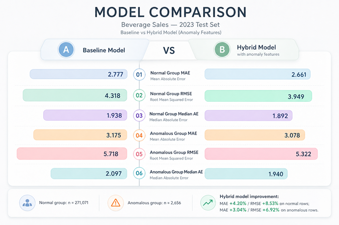

# Analysis by Anomaly Segment

## Project Context

This project evaluates a hybrid forecasting approach for the **Beverage Sales** dataset.

The main idea is to compare:

- a **baseline regression model**
- an **anomaly-aware model**, designed to use anomaly-related information to better handle unusual sales behavior

This analysis focuses on the **test set** and splits the results into two groups:

- `anomaly_flag = 0`: regular observations
- `anomaly_flag = 1`: anomalous observations

The goal is to understand where the anomaly-aware approach helps, where it does not help, and how this affects the final interpretation of the model.

---

## Test Set Distribution

| anomaly_flag | count | share of test set |
|---|---:|---:|
| 0 | 271,071 | 99.03% |
| 1 | 2,656 | 0.97% |

### Key Point

The test set is **highly imbalanced**.

Almost all records belong to the regular group, while anomalous observations represent less than 1% of the test set.

This matters because any global regression metric will be dominated by the performance on `anomaly_flag = 0`.

---

## Performance by Segment

| anomaly_flag | baseline_mae | anomaly_model_mae | mae_improvement | mae_improvement_pct | baseline_rmse | anomaly_model_rmse | rmse_improvement | rmse_improvement_pct |
|---|---:|---:|---:|---:|---:|---:|---:|---:|
| 0 | 2.777472 | 2.769335 | 0.008137 | 0.292973% | 4.317620 | 4.287165 | 0.030455 | 0.705365% |
| 1 | 3.174978 | 3.182396 | -0.007418 | -0.233649% | 5.717656 | 5.719486 | -0.001830 | -0.032006% |

---

## Additional Error Metrics

| anomaly_flag | baseline_median_ae | anomaly_model_median_ae | baseline_max_ae | anomaly_model_max_ae |
|---|---:|---:|---:|---:|
| 0 | 1.938180 | 1.926404 | 263.094056 | 255.654940 |
| 1 | 2.096747 | 2.000483 | 80.584547 | 84.386151 |

---

## Result Interpretation

## 1. Regular Segment (`anomaly_flag = 0`)

For the regular segment, the anomaly-aware model produced **small but consistent improvements**.

### Improvements observed

- **MAE** improved from **2.777472** to **2.769335**
- **RMSE** improved from **4.317620** to **4.287165**
- **Median Absolute Error** improved from **1.938180** to **1.926404**
- **Maximum Absolute Error** improved from **263.094056** to **255.654940**

### Interpretation

This result suggests that the anomaly-aware pipeline did not harm normal observations.  
On the contrary, it provided a small gain across multiple metrics.

Because this segment represents **99.03% of the test set**, even modest gains here are important for the final overall performance.

---

## 2. Anomalous Segment (`anomaly_flag = 1`)

For the anomalous segment, the result is more challenging.

### Results observed

- **MAE** worsened slightly from **3.174978** to **3.182396**
- **RMSE** worsened slightly from **5.717656** to **5.719486**
- **Median Absolute Error** improved from **2.096747** to **2.000483**
- **Maximum Absolute Error** worsened from **80.584547** to **84.386151**

### Interpretation

This means the anomaly-aware model did **not** produce a clear and stable improvement for the anomaly segment.

A possible interpretation is:

- the model may be helping in some typical anomaly cases
- but it still struggles with harder or more extreme anomalous patterns

This is why the **median error improved**, while the average error metrics and the maximum error did not.

---

## Overall Conclusion

The anomaly-aware model delivered its main benefit on the **regular majority group**, not on the **anomalous minority group**.

This is the most honest reading of the results.

### What improved

- better performance for the dominant normal segment
- small but consistent gains in MAE, RMSE, median error, and max error for `anomaly_flag = 0`

### What did not improve clearly

- no stable gain for the anomalous segment
- slight worsening in MAE and RMSE for `anomaly_flag = 1`

---

## Why This Result Makes Sense

There are several technical reasons for this behavior.

### 1. The anomaly segment is very small

There are only **2,656 anomalous records** in the test set.

This gives the model much less information to learn stable patterns for rare cases.

### 2. Anomalous behavior is harder to predict

By definition, anomalies are unusual.  
They often represent rare combinations, unstable patterns, or unexpected local behavior.

Because of that, improving prediction quality on anomalous records is usually more difficult than improving performance on regular records.

### 3. The dataset is synthetic

The Beverage Sales dataset is synthetic, which can make the predictive task easier than in a real production environment.

This is also relevant for the interpretation of **R²**.

A high R² may happen because synthetic data usually has:

- cleaner relationships
- less noise
- more controlled patterns

So a high R² is not necessarily incorrect, but it should be interpreted carefully.

> In this case, a strong R² likely reflects the structured nature of the synthetic dataset, not necessarily the same level of robustness that would be expected in real business data.

---

## Portfolio-Friendly Takeaway

This result is still valuable for a portfolio project because it shows good analytical maturity.

Instead of only reporting one final score, this analysis shows:

- segment-based evaluation
- awareness of imbalance
- honest interpretation of mixed results
- critical thinking about synthetic data limitations

That makes the project stronger, not weaker.

A realistic project does not need perfect results.  
It needs clear reasoning, transparent evaluation, and a solid understanding of model behavior.

## Business Perspective

From a business point of view, this hybrid approach can still be useful.

Even if anomaly handling does not yet improve the rare anomaly segment clearly, it may still help the system become more aware of unusual sales behavior and create a better foundation for:

- demand monitoring
- unusual sales pattern detection
- future alert systems
- more robust forecasting pipelines

This makes the project relevant not only as a regression task, but also as a practical **sales intelligence** and **model monitoring** use case.
